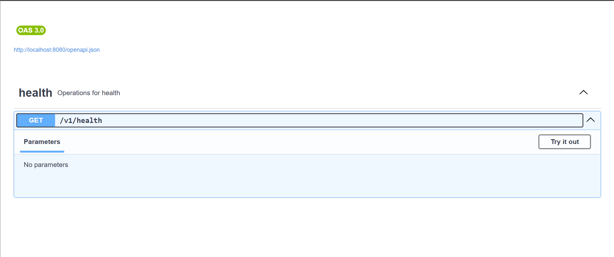
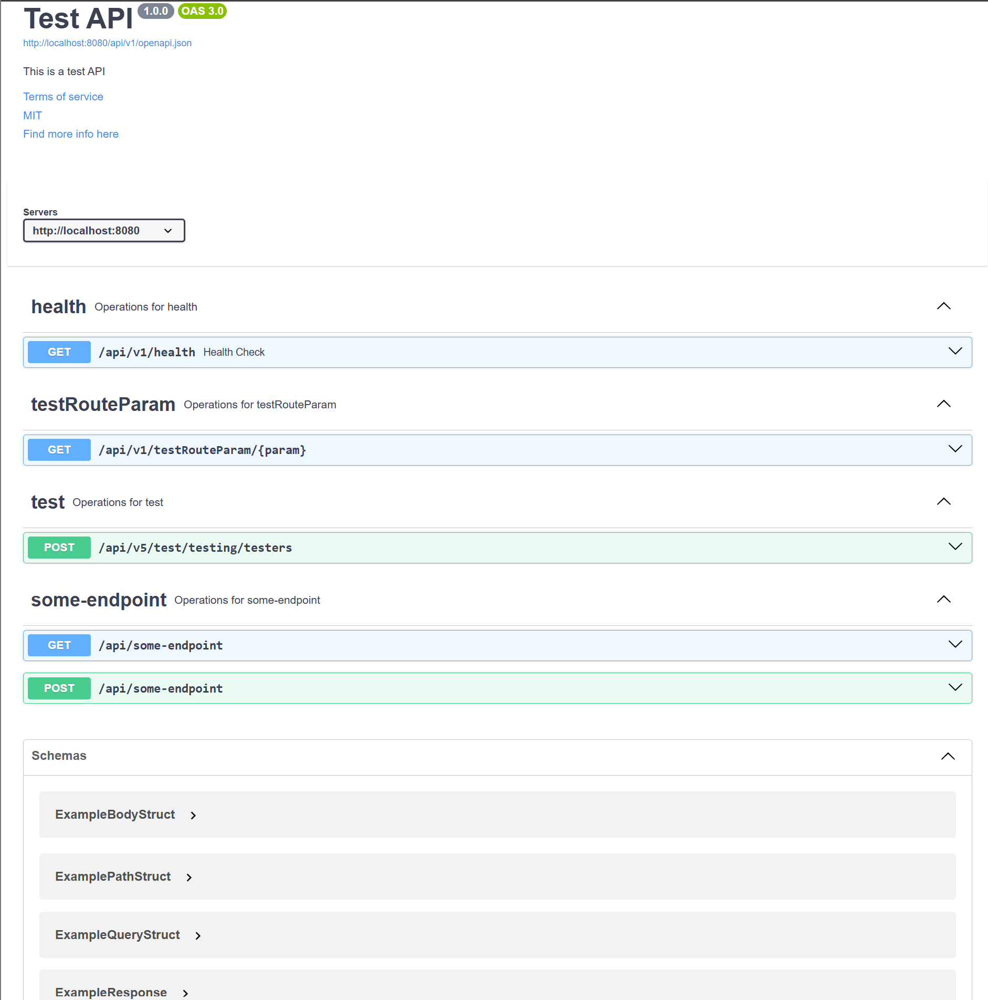

# Auto Swaggo

For those that hate maintaining swagger docs manually, this is a http handler that auto generates open api and swagger documentation for a net/http http server.

## Goals

1. Low Overhead
1. No Dependencies (should entirely use stl packages to function)
1. Clean and Easy to Understand Setup
1. Easy Install 
1. Enforce "structable" data models for intake and outtake.

## Mux Features

- Invalid HTTP Methods Automatically Respond with a 405 (Method not Allowed)
- Invalid Request Bodies Response With a 422 (Unprocessable Entity)
- Auth Callback Failure Responds with a 401 (Unauthorized)
- Authorization Callback Failure Responds with a 403 (Forbidden)
- Version Handling and Multiple Swagger Docs For Versions
- Automatic OpenAPI and Swagger Endpoint Creation
- Ability to automatically open a browser on app run (for local and debugging purposes)

## Usage

Install: `go get github.com/Pieeer1/Auto-SwagGo/swaggo`

## Minimum Functioning Setup

```go

mux := swaggo.NewSwaggoMux(&swaggo.SwaggerInfo{}, "http://localhost:8080", "", []string{})

mux.HandleFunc("/health", health, "v1", swaggo.RequestDetails{ Method:"GET"}) // some arbitrary request
mux.OpenBrowser()

err := http.ListenAndServe(fmt.Sprintf("0.0.0.0:%s", "8080"), mux)

if err != nil {
	log.Fatal(err)
}

```

The above code generates and opens the following swagger: 



## Full Example

```go
package main

import (
	"auto-swaggo/swaggo"
	"fmt"
	"log"
	"net/http"
)

type ExampleChildrenModels struct {
	ExampleInts               []int                       `json:"example_ints" required:"true" description:"Example ints"`
	ExampleChildrenModel      ExampleChildrenModel        `json:"example_children_model" required:"true" description:"Example children model"`
	ExampleChildrenArrayModel []ExampleChildrenArrayModel `json:"example_children_array_model" required:"true" description:"Example children array model"`
}

type ExampleChildrenModel struct {
	ExampleChildrenField string `json:"example_children_field" required:"true" description:"Example children field"`
}

type ExampleChildrenArrayModel struct {
	ExampleChildrenInt int `json:"example_children_int" required:"true" description:"Example children int"`
}

type ExampleQueryStruct struct {
	ExampleQueryField    string `json:"example_query_field" name:"some custom name" required:"true" description:"Example query field"`
	ExampleIntQueryField int    `json:"example_int_query_field" required:"false" description:"Example query field"`
}

type ExampleBodyStruct struct {
	ExampleField    string `json:"example_field" required:"true" description:"Example field"`
	ExampleIntField int    `json:"example_int_field"`
}

type ExampleResponse struct {
	ExampleResponseField    string `json:"example_response_field" required:"true" description:"Example response field"`
	ExampleIntResponseField int    `json:"example_int_response_field"`
}

type ExamplePathStruct struct {
	ExamplePathField string `json:"example_path_field" name:"param" required:"true" description:"Example path field"`
}

func main() {

	mux := swaggo.NewSwaggoMux(&swaggo.SwaggerInfo{
		Title:                   "Test API",
		Description:             "This is a test API",
		TermsOfServiceURL:       "http://example.com/terms/",
		ContactEmail:            "",
		LicenseName:             "MIT",
		LicenseURL:              "http://mit.com",
		Version:                 "1.0.0",
		ExternalDocsDescription: "Find more info here",
		ExternalDocsURL:         "http://example.com",
		Servers:                 []string{"http://localhost:8080"},
	}, "http://localhost:8080", "/api", []string{"v1", "v5"})

	mux.HandleFunc("/health", health, "v1", swaggo.RequestDetails{
		Method:      "GET",
		Summary:     "Health Check",
		Description: "Check the health of the API",
		Responses: []swaggo.ResponseData{
			{
				Code: 200,
				Data: ExampleChildrenModels{
					ExampleInts: []int{1, 2, 34},
					ExampleChildrenModel: ExampleChildrenModel{
						ExampleChildrenField: "example",
					},
					ExampleChildrenArrayModel: []ExampleChildrenArrayModel{
						{
							ExampleChildrenInt: 1,
						},
					},
				},
			},
		},
	})

	mux.HandleFunc("/testRouteParam/{param}", health, "v1", swaggo.RequestDetails{
		Method: "GET",
		Requests: []swaggo.RequestData{
			{
				Type: swaggo.PathSource,
				Data: ExamplePathStruct{
					ExamplePathField: "example",
				},
			},
			{
				Type: swaggo.HeaderSource,
				Data: ExamplePathStruct{
					ExamplePathField: "example",
				},
			},
		},
	})

	mux.HandleFunc("/test/testing/testers", health, "v5", swaggo.RequestDetails{
		Method: "POST",
	})

	mux.HandleFunc("/some-endpoint", health, "", swaggo.RequestDetails{
		Method: "GET",
		Requests: []swaggo.RequestData{
			{
				Type: swaggo.QuerySource,
				Data: ExampleQueryStruct{
					ExampleQueryField:    "example",
					ExampleIntQueryField: 1,
				},
			},
		},
		Responses: []swaggo.ResponseData{
			{
				Code: 200,
				Data: ExampleResponse{
					ExampleResponseField:    "example",
					ExampleIntResponseField: 1,
				},
			},
		},
	}, swaggo.RequestDetails{
		Method: "POST",
		Requests: []swaggo.RequestData{
			{
				Type: swaggo.BodySource,
				Data: ExampleBodyStruct{
					ExampleField:    "example",
					ExampleIntField: 1,
				},
			},
		},
	})

	mux.OpenBrowser()

	err := http.ListenAndServe(fmt.Sprintf("0.0.0.0:%s", "8080"), mux)

	if err != nil {
		log.Fatal(err)
	}
}

func health(w http.ResponseWriter, r *http.Request) {
	w.WriteHeader(http.StatusOK)
	w.Write([]byte("OK"))
}


```


The above code generates and opens the following swagger: 




## Docs

### Struct Field Tags

|  Name |  Description | Example | 
|---|---|---|
| name  | Name of the property  |  name:"some custom name" |
| required  |  Whether or not the property is required  | required:"true"  |
|  description | Description of the properties  |  description:"Some description"  |

All three in use with a json tag:

```go
type ExampleStruct struct {
	ExampleField    string `json:"example_query_field" name:"some custom name" required:"true" description:"Example field"`
	ExampleIntField int    `json:"example_int_query_field" required:"false" description:"Example query field"`
}

```

### New Route Handling

Both Handle Func and Handle are allowed. 
The First two arguments are the same:
1. Route
1. Handler | func(w http.ResponseWriter, r* http.Request)

There are two new arguments

1. Version (a string. Empty string is allowed for no version)
1. Request Details. A theoretically infinite list of requests. Example usage:

```go 

mux.HandleFunc(
	"/some-endpoint",  // this uses the base net/http setup. All are allowed here. Must begin with /
	health, // delegate or handler to call the function on
	"v1", // version. Do not use '/' in the version name. All other version names are valid
	swaggo.RequestDetails{ // This struct is declared for each http method
		Method: "GET", // will return 405 if this the method is not included in this array of structs, and sent to the server
		Requests: []swaggo.RequestData{ // Can have more than one request parameter. IE query params and a body.
			{
				Type: swaggo.QuerySource,
				Data: ExampleQueryStruct{
					ExampleQueryField:    "example", // the values in the instance of the struct are the defaults
					ExampleIntQueryField: 1, // multiple data types allowed :)
				},
			},
		},
		Responses: []swaggo.ResponseData{ // Can have one respose for each status code.
			{
				Code: 200,
				Data: ExampleResponse{
					ExampleResponseField:    "example",
					ExampleIntResponseField: 1,
				},
			},
		},
	}, 
	swaggo.RequestDetails{
		Method: "POST",
		Requests: []swaggo.RequestData{
			{
				Type: swaggo.BodySource, // only one body allowed per method type.
				Data: ExampleBodyStruct{
					ExampleField:    "example",
					ExampleIntField: 1,
				},
			},
		},
	})
```

## Contributing and What's Coming

The following features are planned and will be coming down the line:

1. Squashing some bugs. (please report any issues you find)
1. More Content Type Support

### Currently Missing

1. FormType/MultiformType integration

### Feel free to contribute! Prerequisites:

1. Git
1. Go 1.22.5+
1. An internet connection. 

- running: 
- - Navigate to /internal/integration_tests/ 
- - `go run .`
- testing: `go test ./...`

This is still a work in progress! I would recommend testing before production use.